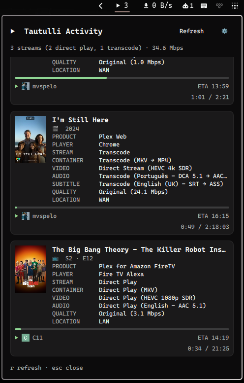

# Omatulli

An [Omarchy](https://omarchy.org/) bar widget for [Tautulli](https://tautulli.com/), the Plex Media Server monitoring tool. See what's currently playing across your Plex server — movies, TV episodes and music — as stacked cards with posters, stream details, progress and ETA.



## Features

- **Bar chip** — play icon + active stream count, with a tooltip summary (direct play/transcode split, total bandwidth)
- **Stacked cards** — one card per active session, adapted per media type:
  - Movies: title + year
  - TV episodes: show + episode title, `S{season} · E{episode}`
  - Music: track + artist, album
- **Poster / album art** — fetched from Tautulli's `pms_image_proxy` API command
- **Full stream detail** — product, player, stream decision (Direct Play/Direct Stream/Transcode), container, video, audio, subtitle and quality lines, mirroring Tautulli's own Activity view
- **Progress bar** with elapsed/total time and ETA (wall-clock finish time)
- **User avatar + name** per session
- **Location privacy** — shows `WAN`/`LAN` only by default instead of the public IP (toggle in settings)

## Requirements

- A running [Tautulli](https://tautulli.com/) instance monitoring your Plex server
- A Tautulli API key (Settings → Web Interface → API in the Tautulli web UI)

## Install

```bash
omarchy plugin add https://github.com/marcuspelo/omatulli.git
```

## Setup

1. Create `~/.config/omatulli/.env` with your Tautulli API key:
   ```
   API_KEY=your-tautulli-api-key
   URL_BASE=http://your-tautulli-host:8181
   ```
   Keeping the key in this file (outside the plugin folder) instead of `shell.json` keeps it out of any config you might sync or share. `URL_BASE` is optional but recommended: `omarchy plugin disable`/`enable` drops the widget's bar-layout entry (including whatever `baseUrl` was set via the panel or `omarchy bar set`), so a value in `.env` is what keeps working across that reset.
2. Enable the widget and point it at your Tautulli instance:
   ```bash
   omarchy plugin enable marcuspelo.omatulli
   omarchy bar set marcuspelo.omatulli baseUrl "http://your-tautulli-host:8181"
   ```
   This step is optional if `URL_BASE` is already set in `.env`.

## Configuration

Available settings (`shell.json`, or `omarchy bar set marcuspelo.omatulli <key> <value>`):

| Setting | Type | Default | Description |
|---|---|---|---|
| `baseUrl` | string | `http://localhost:8181` | Base URL of your Tautulli instance (no trailing slash). Falls back to `URL_BASE` in `~/.config/omatulli/.env` when unset. |
| `refreshIntervalSec` | integer | `10` | Seconds between background refreshes (5–300) |
| `maskLocation` | boolean | `true` | Show only `WAN`/`LAN` instead of the full public IP address |

## Keyboard shortcuts

| Key | Action |
|---|---|
| `r` | Refresh |
| `esc` | Close the panel |

## Remove

```bash
omarchy plugin remove marcuspelo.omatulli
```

## License

MIT
